# Микросервис для извлечения данных авторизации в мессенджер Telegram из виртуального Android

### Сравнительная таблица виртуальных Android решений

| Решение | Производительность | Доступность API | Интеграция с Docker | Конфигурация параметров |
|---------|-------------------|-----------------|---------------------|------------------------|
| **redroid** | Высокая (нативный код в контейнере) | ADB, scrcpy | Да, с  официальными образами | Разрешение, DPI, FPS, RAM, CPU, GPU |
| **Android Studio AVD** | Средняя (требует GUI) | ADB, Android Studio API |  Нет, требует GUI | 	Через AVD Manager
| **Anbox** | Средняя (прослойка) | ADB |  Ограниченная | Ограниченная |
| **Android-x86** | Низкая в контейнере | ADB |  Сложная, требует KVM | Базовая |
| **Genymotion** | Высокая | ADB, свой API |  Платная, ограниченная | Полная, через GUI |

---

### Спецификация конфигурации redroid

| Параметр конфигурации | Значение | Влияние на Telegram |
|----------------------|----------|---------------------|
| **Версия Android** | 12.0 (API 31) | Telegram требует Android 5.0+, версия 12 обеспечивает полную совместимость со всеми функциями |
| **Архитектура** | arm64 | Нативная производительность, быстрый запуск |
| **CPU** | 2+ ядра | Многозадачность: Telegram может работать в фоне, получать уведомления, загружать медиа |
| **RAM** | 2GB+ | Telegram потребляет ~500MB, дополнительные 1.5GB для кэша и других процессов |
| **Хранилище** | 4GB+ | Для кэша медиафайлов, стикеров, историй (может занимать гигабайты) |
| **Разрешение экрана** | 1080x1920 | Оптимальное отображение интерфейса, все элементы правильно масштабируются |
| **DPI** | 480 | Четкие иконки, правильные размеры шрифтов и кнопок |
| **FPS** | 30 | Плавная анимация, скроллинг, воспроизведение видео |
| **Порты** | 5555 (ADB) | Обеспечивает удаленное управление и извлечение данных |
| **Права** | privileged | Необходимо для работы binder и GPU |
| **Модули ядра** | binder_linux, ashmem | Критически важны для функционирования Android в контейнере |

#### Параметры запуска контейнера

```bash
docker run -itd --rm --privileged \
  --pull always \
  --name redroid12 \
  -v ~/data:/data \
  -p 5555:5555 \
  redroid/redroid:12.0.0_64only-latest
```
| Параметр | Описание | 
|----------|----------|
| -itd | Запуск контейнера в фоновом режиме с возможностью подключения |
| --rm | 	Автоматическое удаление контейнера после остановки |
| --privileged | Расширенные привилегии для контейнера |
| --pull always | Всегда загружать последнюю версию образа |
| --name redroid12 | Имя контейнера |
| -v ~/data:/data | Сохранение данных Android на хосте |
| -p 5555:5555 | Доступ к ADB извне контейнера |
---

### Сравнительная таблица методов управления Android

| Метод | Простота интеграции | Скорость отклика | Надежность | Гибкость | Программная автоматизация |
|-------|--------------------|------------------|------------|----------|--------------------------|
| **ADB** | Высокая (готовые библиотеки) | Средняя | Высокая | Полная |  Полная |
| **VNC** | Средняя | Низкая | Средняя | Ограниченная |  Частичная |
| **scrcpy** | Средняя | Высокая | Высокая | Только просмотр |  Нет |
| **Python ADB** | Высокая | Средняя | Высокая | Полная |  Полная |

---


### Описание метода управления ADB (Android Debug Bridge)

**Обоснование выбора:**
1. **Универсальность** - работает со всеми Android-устройствами
2. **Богатый API** - более 100 команд для управления
3. **Надежность** - стандартный инструмент Android
4. **Документация** - огромное сообщество, множество примеров
5. **Автоматизация** - легко интегрируется с Python

### Способ интеграции:
В микросервисе реализованы два уровня работы с ADB:

1. Обычные команды (без root):
  - full_cmd = f"adb -s {ADB_DEVICE} {command}"
2. Команды с root-доступом:
  - Подключение через adb shell
  - Переход в root (su)

---

##  Спецификация извлечения данных

### Локация файлов в Android
/data/data/org.telegram.messenger.web/
- files/
  - tgnet.dat # содержит dc_id и auth_key
  - cache4.db # SQLite база с таблицей users для проверки авторизации
- shared_prefs/
  - userconfing.xml # содержит user_id


### Структура и формат хранения данных 

| Данные | Локация | Формат | Размер | Доступ |
|--------|---------|--------|--------|--------|
| **auth_key** | files/tgnet.dat | Бинарный | 256 байт | root |
| **dc_id** | files/tgnet.dat | Unsigned int | 4 байта | root |
| **user_id** | shared_prefs/userconfing.xml | XML (long) | 8 байт | root |
| **username** | .session файл (SQLite) |	TEXT | переменный | - |

### Структура сохраняемых файлов сессии 
sessions/
  - +79001234567.json
   {
     "phone": "+79001234567",
     "user_id": 123456789,
     "username": "username",
     "dc_id": 2,
     "auth_key": "4f0a4b83...",  # 256 байт в hex
     "extracted_at": "2026-01-01T12:00:00"
   }
  - +79001234567.session        # Telethon session file
 

---

### Алгоритм жизненного цикла

**Запуск контейнера**

- Проверка существующего Android контейнера:
  - docker ps | grep -E 'redroid|android' 
- Если не найден, запуск нового redroid контейнера

**Инициализация**
- Подключение ADB к localhost:5555:
  -  adb connect localhost:5555  
- Проверка наличия Telegram:
  - adb shell pm list packages | grep org.telegram.messenger 
- Если не установлен, скачивание APK (wget) и установка (adb install)

**Авторизация** 
- Очистка данных Telegram (adb shell pm clear org.telegram.messenger.web)
- Запуск Telegram GUI
- Ручной ввод номера через scrcpy
- Ручной ввод кода подтверждения
-  Проверка авторизации через SQLite (sqlite3 cache4.db "SELECT COUNT(*) FROM users;")

**Извлечение данных** 
-  Копирование файлов на /sdcard/ с root правами:
  - - cp /data/data/.../tgnet.dat /sdcard/telegram_session/
  - - cp /data/data/.../userconfing.xml /sdcard/telegram_session/
- Копирование с устройства на хост:
- - adb pull /sdcard/telegram_session/... ./sessions/ 
-  Создание сессии через AndroidTelePorter:
- - session = AndroidSession.from_tgnet(tgnet_path, ...)
- Конвертация в Telethon session файл:   
- - session.to_telethon(phone_session) 
- Чтение SQLite базы сессии: 
- - dc_id, auth_key (из таблицы sessions)  
- - user_id, username (из таблицы entities) 
- Сохранение данных в .json файл: 
- - phone, user_id, username, dc_id, auth_key, extracted_at

**Тестирование сессии** 
- Загрузка .session файла в Telethon:
  - client = TelegramClient(str(session_file), api_id, api_hash)
- Подключение к Telegram:
  - await client.connect() 
- Проверка авторизации:
  - await client.is_user_authorized() 
- Получение данных пользователя:
  - me = await client.get_me() 
  - user_id, username, phone  

---

## Архитектурная диаграмма

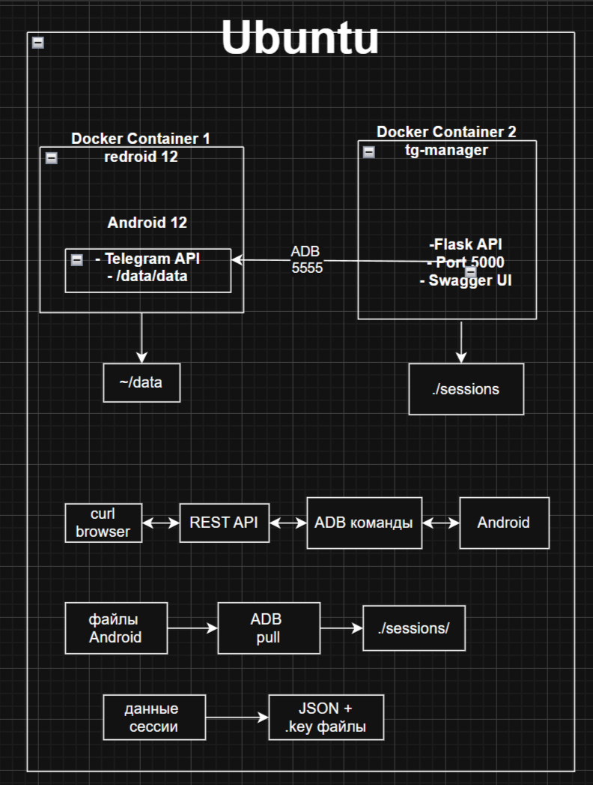

## Установка и запуск 

### Инструкция сборки, запуска, управления и удаления контейнеров

Клонирование репозитория:
  - git clone https://github.com/alyasssski/telegram-auth
  - cd telegram-auth

Для проверки извлечённых сессий необходимо получить API ID и API Hash:
- зайти на сайт https://my.telegram.org 
- войти в аккаунт 
- перейти в API development tools
- создать приложение
- скопировать api_id и api_hash


Запуск с Docker Compose:
- docker-compose up -d --build

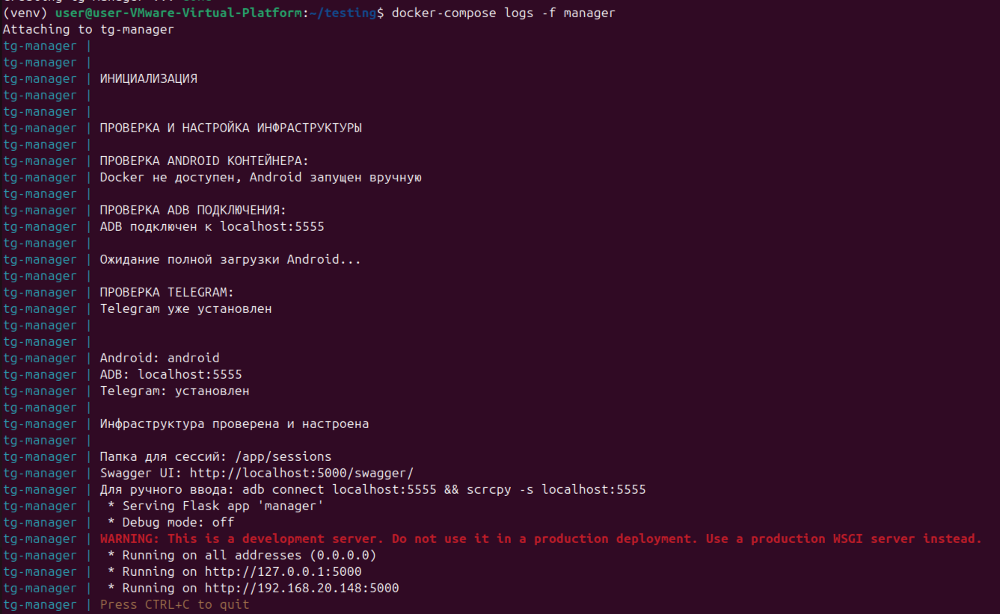

Просмотр логов:
- docker-compose logs -f manager

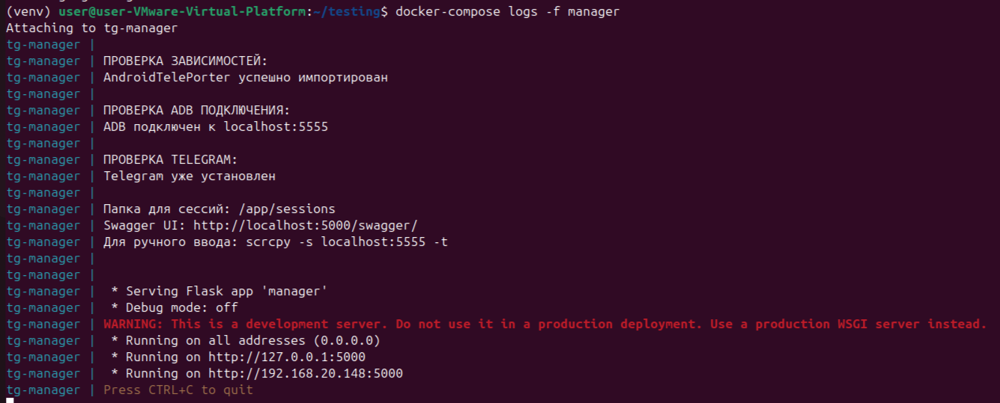

Открытие интерфейса управления:
- открыть Swagger UI по ссылке http://localhost:5000/swagger/ 

Подключение к Android для ручного ввода:
- scrcpy -s localhost:5555

Инструкция по использованию интерфейса:
- default -> выбор запроса -> Try it out -> ввод данных -> Execute


## Примеры использования API

Авторизация (/auth/start):

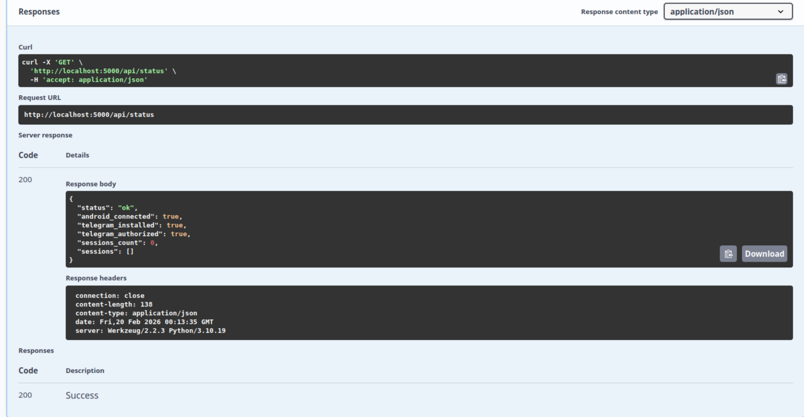

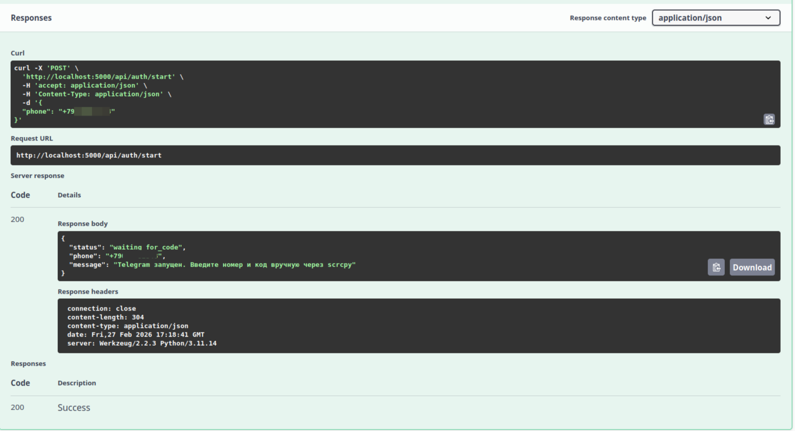

Далее откроется Telegram в Android, нужно будет ввести номер телефона, код подтверждения и пароль.

Проверка статуса (/status):

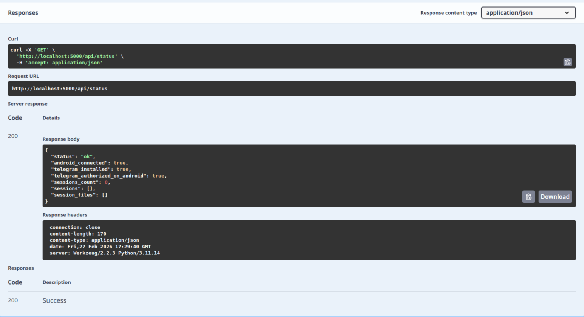 

Извлечение данных сессии (/auth/extract-and-save):

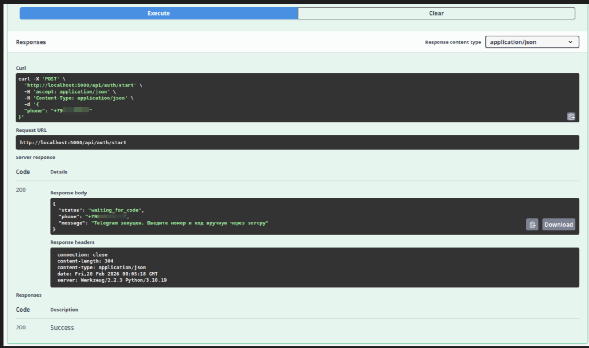

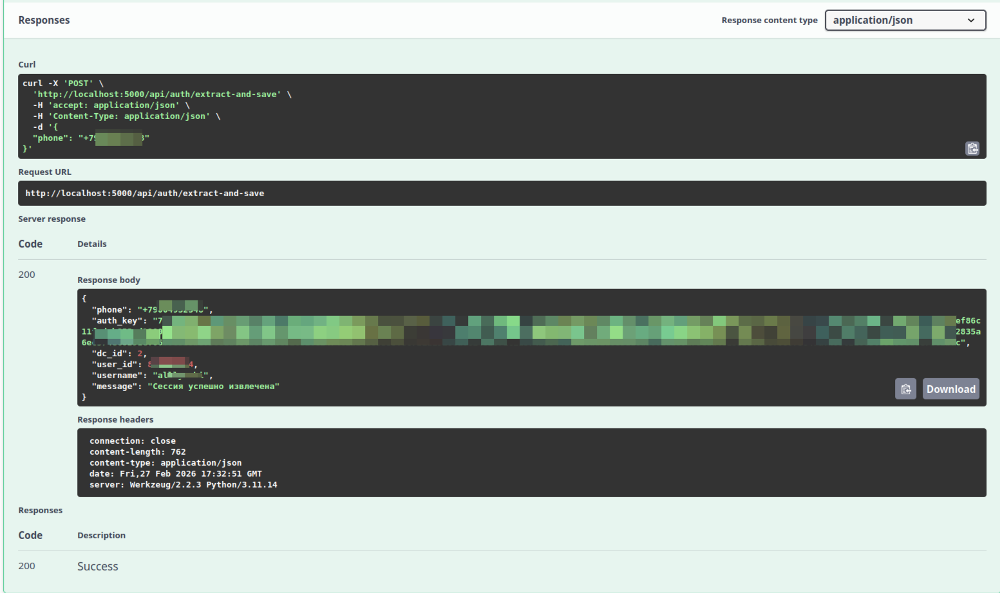

Список всех сессий (/sessions):

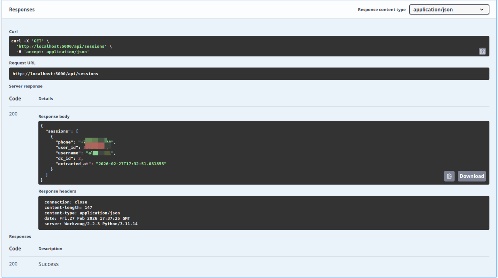

Проверка сессии по извлечённым параметрам (/auth/reauthorize/<phone>)

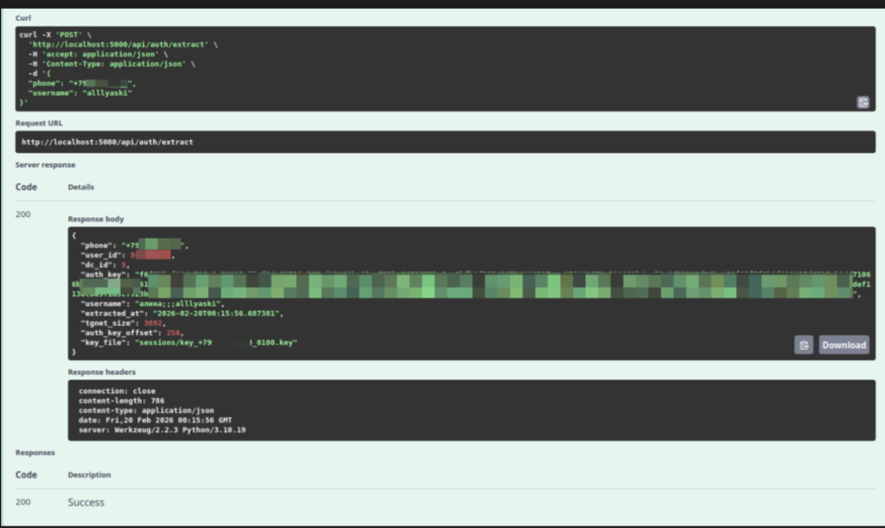

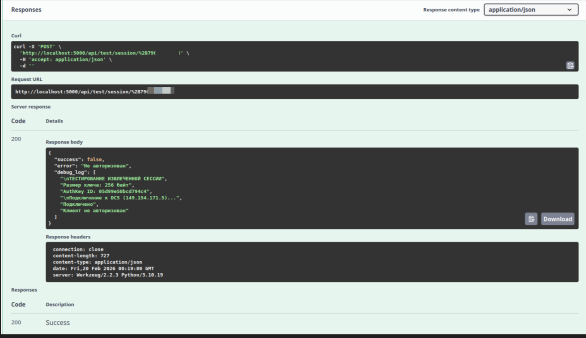

Удаление всех сессий (/sessions DELETE):

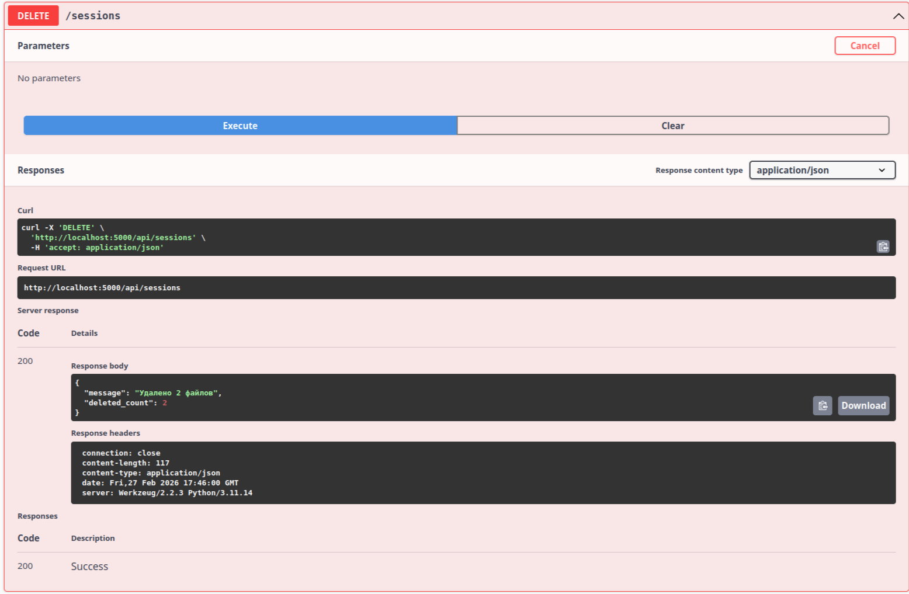

## Управление контейнерами
Удаление контейнера с управляющим микросервисом:
- docker-compose rm -fs manager

Удаление всех контейнеров:
- docker-compose down


###  Описание API  

| Метод | Эндпоинт | Описание |
|-------|----------|----------|
| GET | `/api/status` | Проверка статуса Android и наличие сессий |
| POST | `/api/auth/start` | Запуск Telegram для авторизации |
| POST | `/api/auth/extract-and-save` | Извлечение данных сессии из Android |
| POST | `/api/auth/reauthorize/{phone}` | Проверка сессии с переданными API данными |
| GET | `/api/sessions` | Список всех сохраненных сессий |
| DELETE | `/api/sessions` | Удаление всех сессий и временных файлов |


### Таблица кодов возврата API
| Код	| Описание	| Действие |
|-----|-----------|----------| 
| 200	| Успех	| Запрос выполнен успешно |
| 400	| Ошибка в запросе | Проверить параметры (phone, api_id, api_hash) |
| 404	| Сессия не найдена	| Выполнить извлечение данных сессии |
| 503	| Android не подключен |	Проверить ADB подключение |
| 500 | Внутренняя ошибка сервера | Проверить логи, убедиться что AndroidTelePorter установлен |