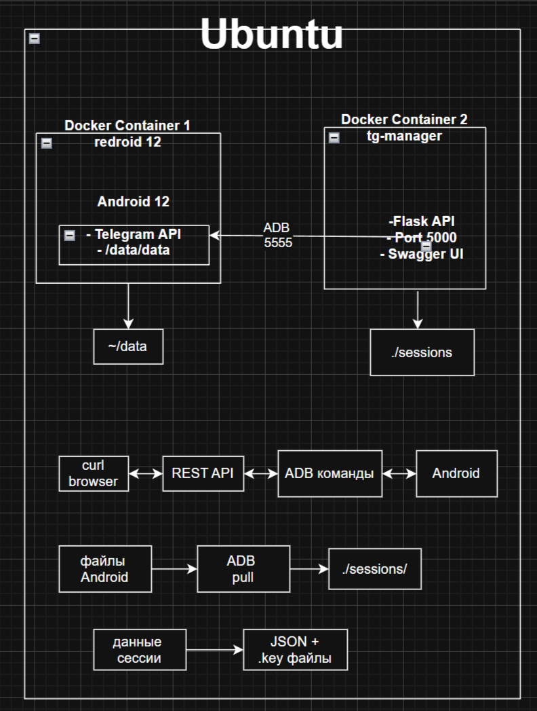
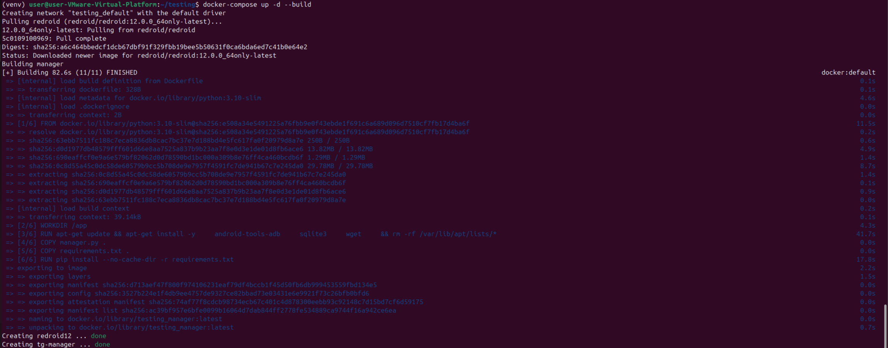
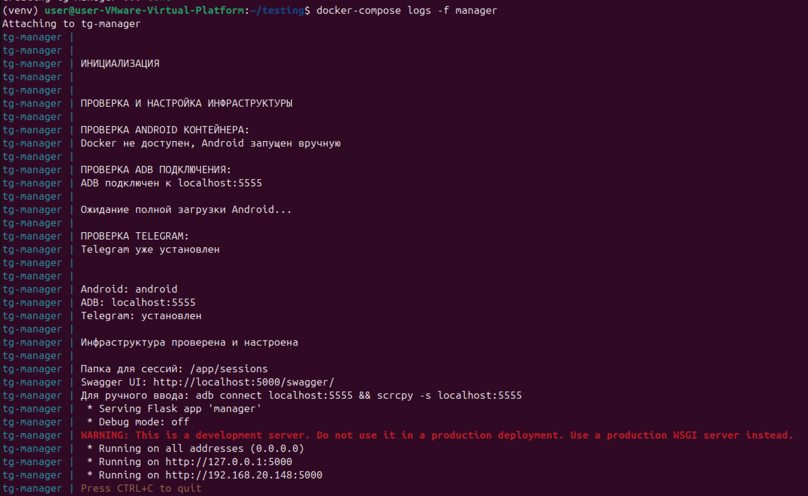
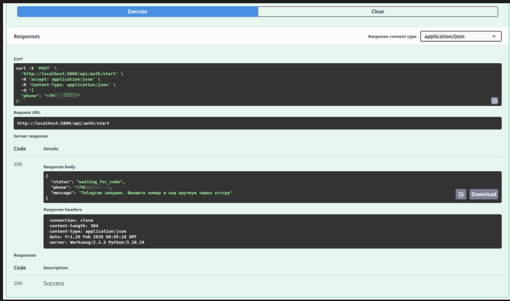
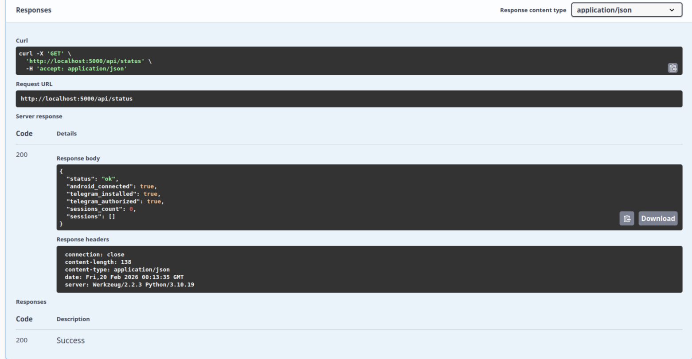
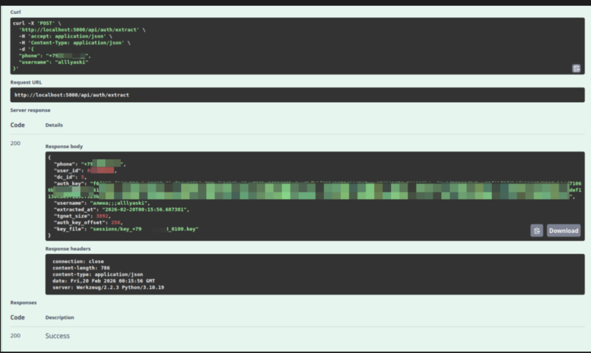
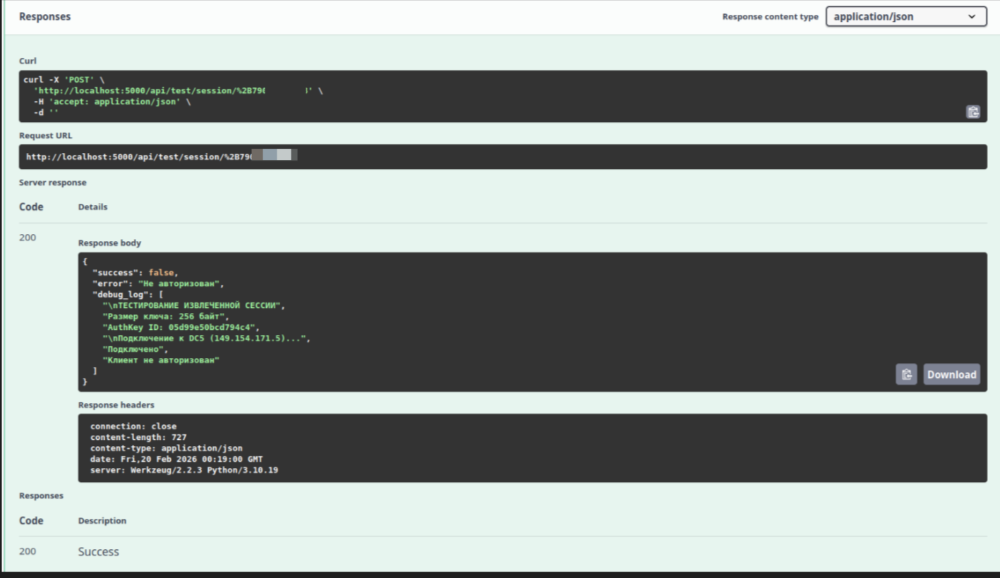

# Микросервис для извлечения данных авторизации в месенджер Telegram из виртуального Android

### Сравнительная таблица виртуальных Android решений

| Решение | Производительность | Доступность API | Интеграция с Docker | Конфигурация параметров |
|---------|-------------------|-----------------|---------------------|------------------------|
| **redroid** | Высокая (нативный код в контейнере) | ADB, scrcpy | Да, с  официальными образами | Разрешение, DPI, FPS, RAM, CPU, GPU |
| **Android Studio AVD** | Средняя (требует GUI) | ADB, Android Studio API |  Нет, требует GUI | 	Через AVD Manager
| **Anbox** | Средняя (прослойка) | ADB |  Ограниченная | Ограниченная |
| **Android-x86** | Низкая в контейнере | ADB |  Сложная, требует KVM | Базовая |
| **Genymotion** | Высокая | ADB, свой API |  Платная, ограниченная | Полная, через GUI |

---

### Спецификация конфигурации redroid

| Параметр конфигурации | Значение | Влияние на Telegram |
|----------------------|----------|---------------------|
| **Версия Android** | 12.0 (API 31) | Telegram требует Android 5.0+, версия 12 обеспечивает полную совместимость со всеми функциями |
| **Архитектура** | arm64 | Нативная производительность, быстрый запуск |
| **CPU** | 2+ ядра | Многозадачность: Telegram может работать в фоне, получать уведомления, загружать медиа |
| **RAM** | 2GB+ | Telegram потребляет ~500MB, дополнительные 1.5GB для кэша и других процессов |
| **Хранилище** | 4GB+ | Для кэша медиафайлов, стикеров, историй (может занимать гигабайты) |
| **Разрешение экрана** | 1080x1920 | Оптимальное отображение интерфейса, все элементы правильно масштабируются |
| **DPI** | 480 | Четкие иконки, правильные размеры шрифтов и кнопок |
| **FPS** | 30 | Плавная анимация, скроллинг, воспроизведение видео |
| **Порты** | 5555 (ADB) | Обеспечивает удаленное управление и извлечение данных |
| **Права** | privileged | Необходимо для работы binder и GPU |
| **Модули ядра** | binder_linux, ashmem | Критически важны для функционирования Android в контейнере |

#### Параметры запуска контейнера

```bash
docker run -itd --rm --privileged \
  --name redroid12 \
  -v ~/data:/data \
  -p 5555:5555 \
  redroid/redroid:12.0.0_64only-latest
```
| Параметр | Описание | 
|----------|----------|
| -itd | Запуск контейнера в фоновом режиме с возможностью подключения |
| --rm | 	Автоматическое удаление контейнера после остановки |
| --privileged | Расширенные привилегии для контейнера |
| --name redroid12 | Имя контейнера |
| -v ~/data:/data | Сохранение данных Android на хосте |
| -p 5555:5555 | Доступ к ADB извне контейнера |
---

### Сравнительная таблица методов управления Android

| Метод | Простота интеграции | Скорость отклика | Надежность | Гибкость | Программная автоматизация |
|-------|--------------------|------------------|------------|----------|--------------------------|
| **ADB** | Высокая (готовые библиотеки) | Средняя | Высокая | Полная |  Полная |
| **VNC** | Средняя | Низкая | Средняя | Ограниченная |  Частичная |
| **scrcpy** | Средняя | Высокая | Высокая | Только просмотр |  Нет |
| **Python ADB** | Высокая | Средняя | Высокая | Полная |  Полная |

---


### Описание метода управления ADB (Android Debug Bridge)

**Обоснование выбора:**
1. **Универсальность** - работает со всеми Android-устройствами
2. **Богатый API** - более 100 команд для управления
3. **Надежность** - стандартный инструмент Android
4. **Документация** - огромное сообщество, множество примеров
5. **Автоматизация** - легко интегрируется с Python

### Способ интеграции:
В микросервисе реализованы два уровня работы с ADB:

1. Обычные команды (без root):
  - full_cmd = f"adb -s {ADB_DEVICE} {command}"
2. Команды с root-доступом:
  - Подключение через adb shell
  - Переход в root (su)

---

##  Спецификация извлечения данных

### Локация файлов в Android
/data/data/org.telegram.messenger.web/
- files/
  - tgnet.dat # Основной файл сессии
  - cache4.db # SQLite база данных


### Структура и формат хранения данных

| Данные | Локация | Формат | Размер | Доступ |
|--------|---------|--------|--------|--------|
| **auth_key** | tgnet.dat | Бинарный | 256 байт | root |
| **dc_id** | tgnet.dat | Unsigned int | 4 байта | root |
| **user_id** | cache4.db (таблица users) | SQLite INTEGER | 8 байт | root |

### Структура сохраняемых файлов сессии
- sessions/
  - +79001234567.json
    - phone: "+79001234567"
    - user_id: 123456789
    - dc_id: 2
    - auth_key: "4f0a4b83..." (256 байт hex)
    - username: "user"
    - extracted_at: "2024-01-01T12:00:00"
    - key_file: "key_+79001234567_0100.key"
  - key_+79001234567_0100.key
    - [бинарный ключ в hex формате]

---

### Алгоритм жизненного цикла

**Запуск контейнера**

- Проверка существующего Android контейнера
  - Если не найден, запуск нового redroid контейнера

**Инициализация**
- Подключение ADB к localhost:5555
- Проверка наличия Telegram
  - Если не установлен, то установка APK

**Авторизация** 
- Очистка данных Telegram
- Запуск Telegram GUI
- Ручной ввод номера через scrcpy
- Ручной ввод кода подтверждения
- Ожидание появления tgnet.dat

**Извлечение данных**
- Копирование tgnet.dat и cache4.db
- Парсинг tgnet.dat для auth_key и dc_id
- Парсинг cache4.db для user_id и username
- Сохранение ключа в .key файл
- Сохранение метаданных в .json

**Тестирование сессии**
- Загрузка auth_key в Telethon
- Подключение к указанному DC
- Проверка авторизации
- Получение данных пользователя


---

### Архитектурная диаграмма



## Установка и запуск 

### Требования к системе
- Ubuntu 20.04+
- Docker 20.10+
- Модули ядра: binder_linux, ashmem_linux
- Virtualization support (VT-x/AMD-V)
- 4GB+ RAM

### Начальная настройка ОС

- sudo apt update
- sudo apt upgrade -y
- sudo apt install -y apt-transport-https ca-certificates curl software-properties-common
- sudo apt install ca-certificates curl
- sudo install -m 0755 -d /etc/apt/keyrings
- sudo curl -fsSL https://download.docker.com/linux/ubuntu/gpg -o /etc/- apt/keyrings/docker.asc
- sudo chmod a+r /etc/apt/keyrings/docker.asc
- sudo tee /etc/apt/sources.list.d/docker.sources <<EOF
Types: deb
URIs: https://download.docker.com/linux/ubuntu
Suites: $(. /etc/os-release && echo "${UBUNTU_CODENAME:-$VERSION_CODENAME}")
Components: stable
Signed-By: /etc/apt/keyrings/docker.asc
EOF
- sudo apt update
- sudo apt install docker-ce docker-ce-cli containerd.io - docker-buildx-plugin docker-compose-plugin
- sudo systemctl status docker
- sudo apt install -y linux-modules-extra-$(uname -r)
- ls /lib/modules/$(uname -r)/kernel/drivers/android/
- sudo modprobe binder_linux devices="binder,hwbinder,vndbinder"
- lsmod | grep -E "binder|ashmem"
- whoami
- groups $USER
- ls -la /var/run/docker.sock
- sudo usermod -aG docker $USER
- newgrp docker
- egrep -c '(vmx|svm)' /proc/cpuinfo
- sudo apt install android-tools-adb android-tools-fastboot -y
- mkdir -p ~/data
- sudo apt install -y scrcpy
- python3 -m venv venv
- pip install flask flask-restx telethon requests docker


### Инструкция сборки, запуска, управления и удаления контейнеров

Клонирование репозитория:
  - git clone https://github.com/alyasssski/telegram-auth
  - cd telegram-auth
  - source venv/bin/activate

Перед сборкой проекта необходимо:
- зайти на сайт https://my.telegram.org 
- войти в аккаунт 
- перейти в API development tools
- создать приложение
- вставить в manager.py значения API_ID и API_HASH

Запуск с Docker Compose:
- docker-compose up -d --build



Просмотр логов:
- docker-compose logs -f manager



Открытие интерфейса управления:
- открыть Swagger UI по ссылке http://localhost:5000/swagger/ 

Инструкция по использованию интерфейса:
- выбор запроса -> Try it out -> ввод данных -> Execute

Авторизация (/auth/start):



Проверка статуса подключения к Android (/status):



Извлечение данных сессии (/auth/extract):



Авторизация по извлечённым параметрам (/test/session/{phone})


Однако, авторизовать доступ к аккаунту не получилось, возможно, из-за шифрования, неправильного извлечения данных auth_key и dc_id или Passkey. 

Удаление контейнера с управляющим микросервисом:
- docker-compose rm -fs manager

Удаление двух контейнеров:
- docker-compose down


###  Описание API

| Метод | Эндпоинт | Описание |
|-------|----------|----------|
| GET | `/api/status` | Проверка статуса подключения |
| POST | `/api/auth/start` | Начало авторизации |
| POST | `/api/auth/verify` | Проверка статуса авторизации |
| POST | `/api/auth/extract` | Извлечение данных сессии |
| POST | `/api/test/session/{phone}` | Тестирование сессии |
| GET | `/api/sessions` | Список всех сессий |
| GET | `/api/session/{phone}` | Получение сессии |
| DELETE | `/api/session/{phone}` | Удаление сессии |
| GET | `/api/diagnose/network` | Диагностика сети |


### Таблица кодов возврата API
| Код	| Описание	| Действие |
|-----|-----------|----------| 
| 200	| Успех	| Запрос выполнен |
| 400	| Ошибка в запросе | Необходимо проверить параметры |
| 404	| Сессия не найдена	| Необходимо выполнить извлечение данных сессии |
| 503	| Android не подключен |	Необходимо  проверить ADB подключение |